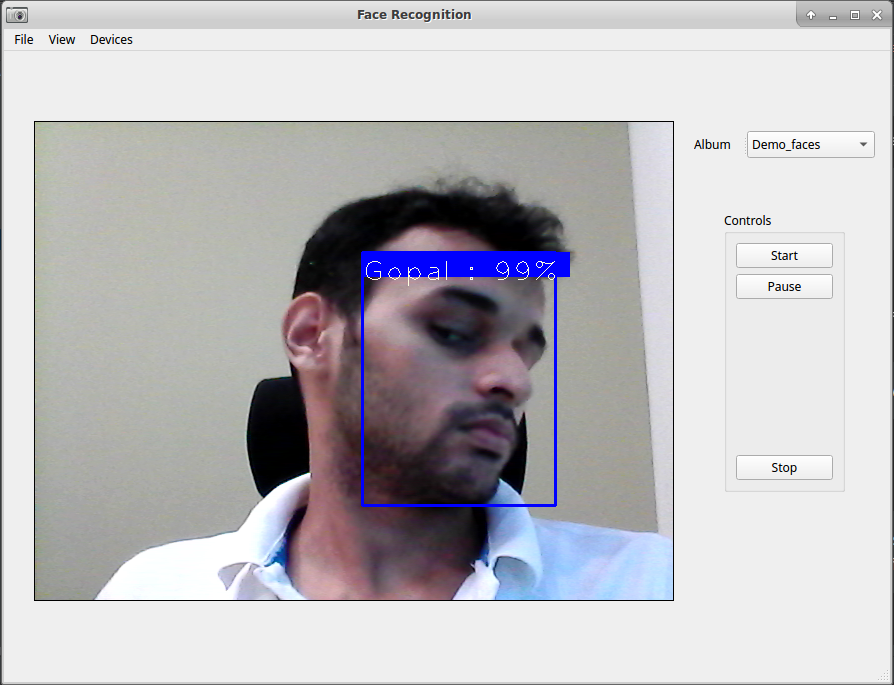
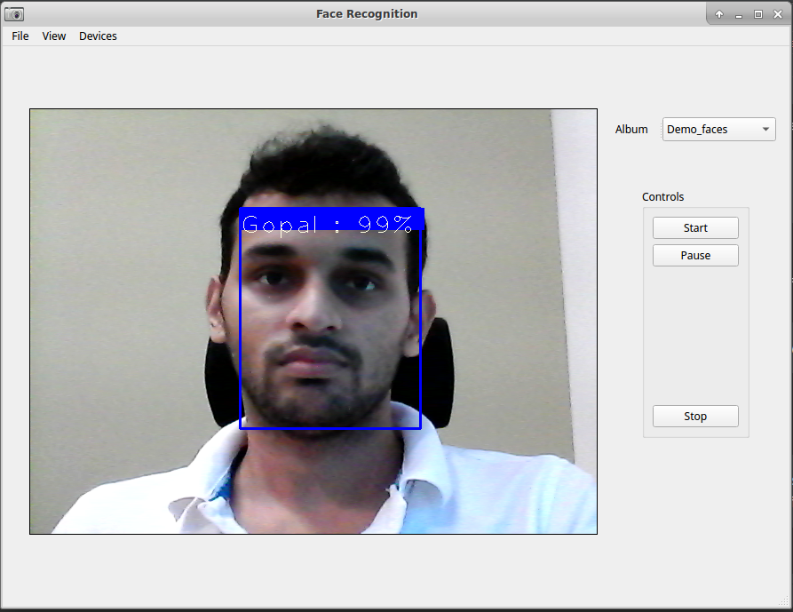
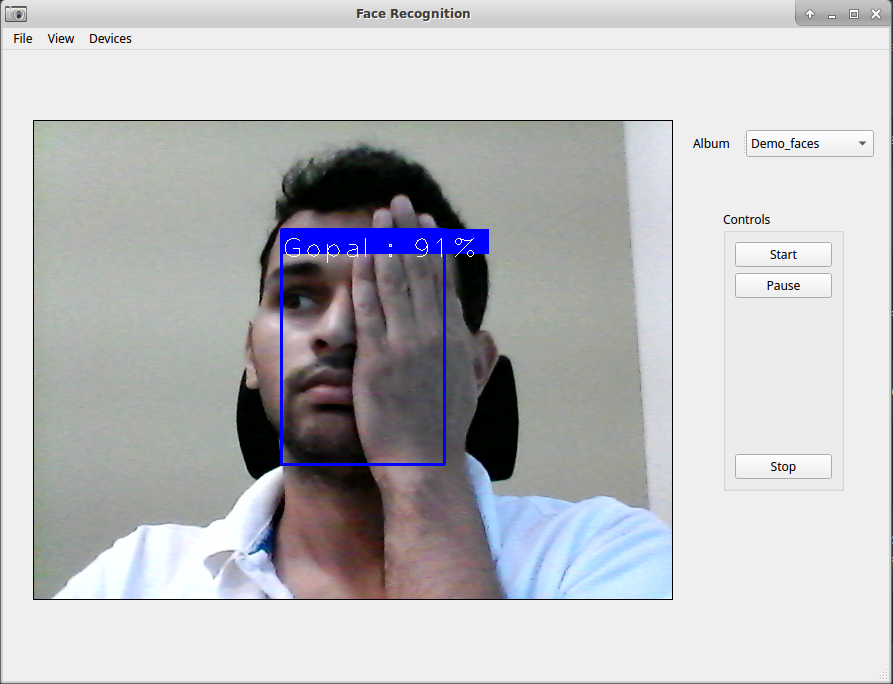

# Face recognition application using AWS Rekognition and PyQt5
This is a simple desktop application for face recognition. It uses AWS Rekognition APIs
for the face recognition task. We plan to add different recognition
strategies that will run entirely on the local PC as opposed to sending
video frames to the cloud and getting the results back. Trust me, the method of using cloud APIs is
not only slow but also expensive for a real-time 24x7 kind of application!

The application is built on top of PyQt5 framework to provide simple
UI to register faces and create face albums

The application is tested working on Python 3.5.2 running on Ubuntu 16.04LTS

You can find more details on the implementation and working of the application
in [this blog series]() - **upcoming**

# Setup
1. Install python packages. You can also create a virtualenv in order not to
mess up with your other development setup.
```bash
pip3 install -r requirements.txt
```
2. Create AWS account and create a role and include the credentials in ~/.aws/credentials file.
See the example credentials file below.
```text
[default]
aws_access_key_id = <your access key>
aws_secret_access_key = <your secret key>

```
3. Also, configure your AWS region in ~/.aws/config file as below.
```text
[default]
region = <aws region>

```

4. [Optional] The Qt Designer UI files can be built using build_ui.sh. This is
needed only if you modify the UI files. Run the following command to generate
python files from UI files.
```bash
./build_ui.sh
``` 

That's it we are good to run the application!

# Running
Simply run `main.py`
```bash
python main.py
```

# Demo
| | | |
|:-------------------------:|:-------------------------:|:-------------------------:|
||||


# Using the application
You need to register target faces that you want to recognize. The registered faces are stored in
albums. You need to create an album to start registering the faces. You can create more than one
albums such as `Family`, `Office` etc.

## Creating face album
**File -> Add album**
Give a unique name and save.

## Registering face/s into an album
After creating album, you can register one or more face with the created album.

**File -> Register faces**

While registering faces, make sure that the picture contains only one face. If there are more than
one faces, the largest face will be registered with the name provided.

## Running the face recognition on Webcam video stream
From the main window, you can choose the face album on which you want to run the recognition.
If there is only one album, it will be chosen by default.

Use **Start** and **Stop** button to control the application.

## Deleting a face album
You can delete the face album with

**File -> Delete album**

Note that all the faces stored in the album along with other metadata will be lost after deleting.
